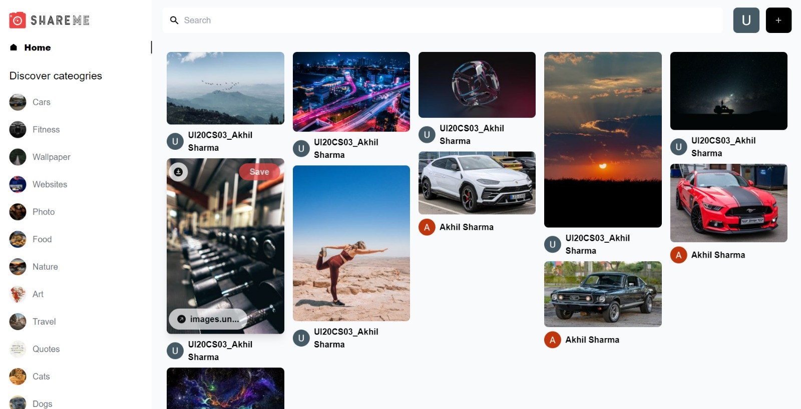

# Shareme
React social media app for sharing pictures

# Image Sharing Platform Share Me

A simple web application to upload and download the images

<p align="center">
  Sample Desktop Application 👇
</p>

<p align="center"> Demo pic


</p>

## Built With

This project was built using these technologies.

- React
- Tailwind
- React Router Dom
- Google Auth
- Sanity
- React Router Dom
- Deployed on Vercel

## Features are:

- Sidebar.
- Users can add new images.
- Users can save the new images.
- Users can comment on each and every user post.
- User can delete there uploaded images.
- Users can add new images.
- Users can search for the images.
- Users can download the images.
- User can see the uploaded images.
- User can see there saved images.
- Masonry Image Effect.
- Google Auth.
- Image Categories.

### 🛠 Installation and Setup Instructions

To get started just clone this repository. You will need `node.js`, `sanity` and `git` installed globally on your machine.

Run

```
npm install
```

```
npm start
```

Open [http://localhost:3000](http://localhost:3000) with your browser to see the result.


